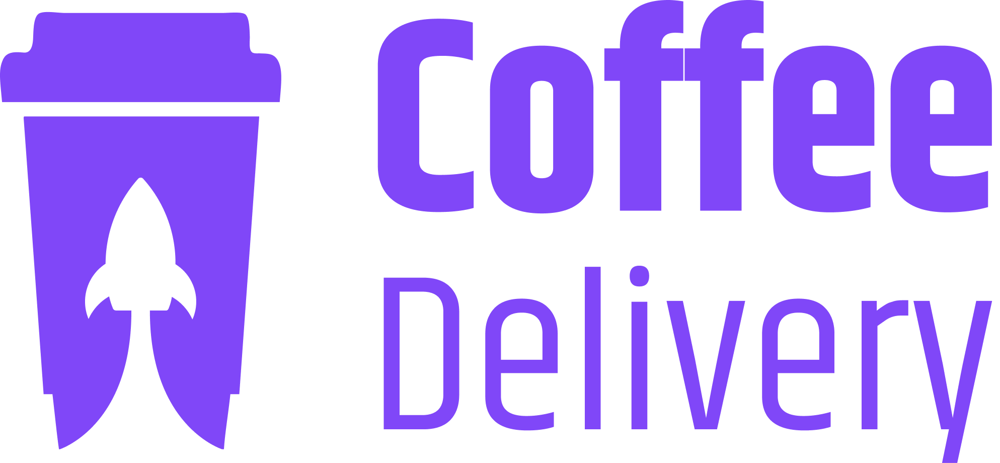
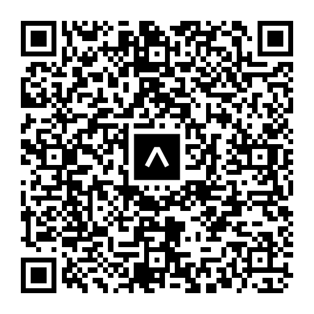

<h1 align="center">
  
</h1>

<p align="center">
  

  

  

  

  
</p>

<p align="center">
  README ENGLISH | <a href="readme-portuguese.md">Read portuguese</a>
</p>

<div display: flex align="center">
  
</div>

## 💻 Project

Coffee Delivery is a mobile application for purchasing coffees. This challenge focuses on building animations.

## ✨ Technologies

- [x] Typescript
- [x] Expo
- [x] Expo Router
- [x] NativeWind
- [x] React Native Reanimated
- [x] React Native Gesture Handler

## 📄 Prerequisites

- [x] NodeJS >= 20.0
- [x] Expo >= 52
- [x] Android Studio
- [x] Xcode (apenas para macOS)
- [x] Expo Go (opcional para devices)

## Running the Project

Install the dependencies using npm in your terminal and run the application on your Android or iOS device with Expo:
```cl
npx expo start
```

## App Demo

Caso queira utilizar o app em seu device, você pode utilizar o app **Expo Go** e testar todas as funcionalidades do app
<br />
If you want to use the app on your device, you can use the Expo Go app to test all the app's features. <br /> If your device is Android, open the Expo Go app, select the "Scan QR code" option, and if your device is iOS, open your camera app and point the open camera of both devices to scan the QR code below:

<p align="center">
  
</p>

<br />

## 📄 Licença

This project is under the MIT license. See the [LICENSE](LICENSE.md) file for more details.
